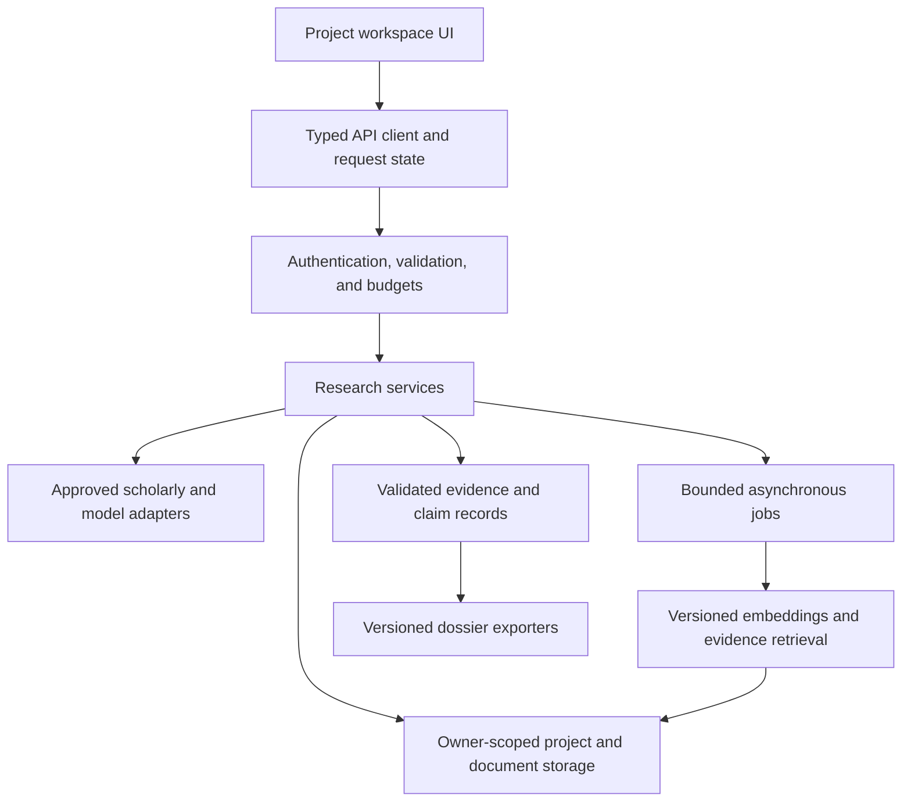

# Target architecture and migration

Status: proposed. Keep the static frontend and Netlify endpoints while introducing contracts and modules. A framework rewrite is not a prerequisite for the rebrand; choose one only when routing/state/component requirements justify the migration cost.

## Boundaries



Introduce background jobs only after synchronous operations have measured timeout/budget requirements. Do not assume a serverless response keeps fire-and-forget work alive. Reuse Redis/vector adapters where they fit the verified requirements rather than adding databases from backlog enthusiasm.

## Incremental repository structure

This tree is a target, not a set of empty folders created in this phase. Add code directories when their first implementation lands.

```text
public/
  index.html
  app.js                       thin bootstrap during migration
  js/
    api/                       HTTP client, errors, cancellation
    state/                     project and request state
    features/                  discovery, reader, evidence, brief
    components/                semantic UI components
    export.js                  one shared export implementation
  styles/                      tokens, base, components, themes
  assets/                      approved brand assets
netlify/functions/             existing compatible route adapters
  shared/
    auth/                      access and ownership checks
    contracts/                 runtime request/response validation
    providers/                 scholarly, model, storage adapters
    services/                  retrieval, projects, analysis, export
    skills/                    bounded research-task implementations
tests/
  fixtures/                    licensed or synthetic source fixtures
  integration/                 provider/contract and persistence tests
  e2e/                         real user flow and keyboard checks
scripts/                       reviewed local and maintenance commands
docs/                          tracked public specifications
logs/decisions/                 ignored local decisions and reasons
logs/audit/                     ignored diagnostic outputs
data/ uploads/ artifacts/ tmp/  ignored private/generated local content
```

Do not move the current routes wholesale before behavior is protected by tests. Avoid naming all service modules `utils`: provider behavior, policy, parsing, and product logic need separate responsibilities.

## Domain contracts

| Entity       | Minimum information                                                                                |
| ------------ | -------------------------------------------------------------------------------------------------- |
| Project      | ID, verified owner ID, question, title, timestamps, schema version                                 |
| Paper        | Internal ID; DOI and provider IDs; title/authors/year; provenance; abstract/full-text availability |
| Document     | Owner/project ID, content hash, parser version, page coverage, storage location, retention         |
| Passage      | Document/paper ID, passage ID, actual page/section when available, source text, indexing version   |
| Extraction   | Paper ID, field, value or not-reported, evidence IDs, method/version, review status                |
| Claim        | Text, question relationship, cited evidence IDs, limitations, review status                        |
| Analysis run | Skill ID/version, model/provider, corpus snapshot, budget, stage state, timestamps                 |
| Job          | Verified owner/project ID, task type, idempotency key, state, progress, sanitized error            |
| Dossier      | Schema version, project/search metadata, papers, claims, evidence, limitations, review state       |

Types must reflect missing values: `year` can be null, provenance cannot be guessed, and absent full text is a meaningful state. Do not invent a current year or a graph year of 2020 for unknown dates.

## API and policy layer

Retain `/api/search`, `/api/consensus`, `/api/compare`, `/api/network-graph`, `/api/citation-context`, `/api/pdf-upload`, `/api/pdf-chat`, `/api/pdf-explain-math`, and `/api/sessions` as adapters during migration. Define a versioned contract before changing payloads. New project APIs may follow when owner-scoped persistence exists.

Common policy sequence: enforce allowed method -> authenticate where required -> authorize project/documents -> validate body and size -> reserve quota -> execute with deadline -> validate output -> return typed response. OPTIONS is a routing concern, not authorization. CORS restricts browser sharing; it does not stop direct clients from invoking an unauthenticated API.

Use a shared error envelope containing stable code, safe message, retryability, and request ID. Distinguish `unavailable`, `insufficient_evidence`, upstream rate limit, malformed input, unauthorized access, and actual internal error. Never return provider diagnostics containing secrets or full private prompts.

Provider configuration owns supported model IDs, embedding dimensions, batch capability, request budgets, and timeout policy. The UI lists only tested adapters. Google structured output can constrain generated JSON, but the server must also validate business rules and source IDs ([official documentation](https://ai.google.dev/gemini-api/docs/structured-output)).

## Storage and retrieval

Search metadata can be public/shared where appropriate; uploaded documents, notes, projects, and analysis runs require owner isolation. Cache keys should include schema/provider/ranking/filter version and normalized query. Private caches also include owner/corpus identity. Never put credentials in keys.

Index each document once using a content hash plus parser/chunking/model version. Persist page/section anchors when the parser actually exposes them. Retrieve only authorized passages; bound top-k, input size, and downstream generation. Changing embedding models requires a separate namespace/dimension check and re-index strategy.

Prefer a job pipeline for upload -> validate -> parse -> chunk -> embed -> mark ready. Report partial indexing visibly. Define limits, retention, deletion propagation, and whether the original file can be downloaded. Do not add object storage without lifecycle and access policy.

## Frontend state

Represent each panel as a stage with idle/running/completed/partial/unavailable/failed/cancelled status. A query receives a unique run ID; only the active run may update the view. Abort obsolete requests where possible. Keep corpus selection stable while analysis updates, and preserve useful discovery results if generation fails.

Adopt semantic DOM rendering for source text, a safe rich-text pathway where needed, one export module used by UI and tests, and design tokens shared between marketing and the workspace. Build CSS/assets locally instead of using a development CDN in production ([Tailwind documentation](https://tailwindcss.com/docs/installation/play-cdn)).

## Verification and observability

Keep unit tests, add schema/provider contract tests and a small real-PDF fixture, then add end-to-end research, save/resume, and export flows. Validate cross-owner denial, malicious metadata, stale searches, partial providers, rate limits, oversized PDFs, and no-key states.

Runtime telemetry should record request/run IDs, stage timing, provider status, cache hits, token/cost counters, and sanitized failure codes. Local `logs/decisions/` records human-facing project decisions only. Do not store raw prompts, credentials, document text, or collected internal reasoning in routine logs.

## Migration and rollback

1. Add shared safety/contracts without route or visual changes; preserve existing valid payloads.
2. Consolidate provider helpers and exports behind existing interfaces.
3. Split the frontend controller into modules with preserved IDs and behavior.
4. Introduce project ownership and a versioned dossier; migrate only validated records.
5. Apply approved identity/design and capture the new workflows.
6. Add bounded jobs/retrieval and new skills after baseline evaluation.

Use feature flags for new project/analysis views, version stored records, and keep a read adapter for old exports. Roll back UI/modules independently from persisted schema migrations. Never rename deployment/repository identities as an incidental code refactor.
