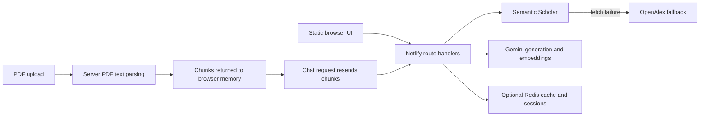

# Abstractify repository audit

Date: 2026-09-27. Baseline: clean working tree before this review; 121 tracked files. This report is an engineering and product-source audit, not a completed browser UX audit or penetration test.

## Executive assessment

Abstractify has a useful research prototype underneath an ambitious product presentation: search, abstract-based classification and extraction, reference graphs, PDF text parsing, and a limited tool-routing assistant. Its best assets are a small deployable architecture, existing tests, reusable provider adapters, export support, and extensive contributor documentation.

A premium rebrand should be built around traceable research evidence. Renaming the current interface alone would preserve problems in trust, ownership, credential handling, retrieval cost, and feature accuracy. Address the release blockers first, modularize the frontend incrementally, then ship a coherent research workflow.

The recommendations are judgments from the inspected source, not measured customer demand. Latency, deployment configuration, actual API billing, production traffic, domain ownership, and brand availability were not verified.

## Inventory and implementation map

| Surface          | Current state                                                                                             | Implication                                                                                           |
| ---------------- | --------------------------------------------------------------------------------------------------------- | ----------------------------------------------------------------------------------------------------- |
| Frontend         | `public/index.html`: 601 lines; `public/app.js`: 917 lines / 42,396 bytes; `public/styles.css`: 276 lines | Marketing, credentials, search, results, graphs, chat, and exports are coupled in one page/controller |
| API              | Nine route handlers under `netlify/functions/`, plus `_utils.ts`                                          | Straightforward deployment boundary; validation and authorization need a shared layer                 |
| Provider helpers | `_utils.ts` plus duplicate `shared/utils.ts`                                                              | Different models and credential transport can diverge                                                 |
| Persistence      | Redis search cache and sessions; optional vector adapter                                                  | Search caching is wired; durable PDF/vector retrieval is not                                          |
| Tests            | Eight test files across endpoints, utilities, adapters, and exports                                       | Useful unit baseline; little assurance for the live DOM controller and real PDF extraction            |
| Product specs    | 36 issue specification files                                                                              | Backlog is much broader than the shipped implementation                                               |
| Research         | Notebook with 133 cells, 127 code cells, and 86 output entries                                            | Experimental material; do not equate notebook capabilities with production integration                |
| Automation       | 22 YAML files across GitHub config/workflows and local infrastructure                                     | Community support is extensive relative to the small runtime; governance needs review                 |

### Current request path

The browser does not hold a reusable vector index. PDF chat embeds supplied chunks inside the backend handler. The vector adapter exists independently of that path.

## Feature truth matrix

| Promise or feature                      | Evidence                                      | Assessment                                                                                                    |
| --------------------------------------- | --------------------------------------------- | ------------------------------------------------------------------------------------------------------------- |
| Semantic Scholar and OpenAlex discovery | `search.ts:49`, `search.ts:82`                | Implemented as primary source plus exception fallback, not simultaneous federation                            |
| Semantic ranking                        | `search.ts:125`, `search.ts:137`              | Backend embeddings of query and candidate abstracts; no reusable paper embedding cache in this handler        |
| Consensus meter                         | `consensus.ts:85`, `consensus.ts:143`         | Abstract stance classification with unweighted support ratio; not a meta-analysis or certainty score          |
| Key-free consensus                      | `consensus.ts:31`                             | Keyword heuristic, which can misclassify negation and irrelevant statements                                   |
| Study comparison                        | `compare.ts:53`, `compare.ts:93`              | Model extracts from title/abstract only; JSON type assertions do not validate output at runtime               |
| Key-free comparison                     | `compare.ts:37`                               | Placeholder fields; the text says TF-IDF, but no TF-IDF computation occurs there                              |
| Citation graph                          | `network-graph.ts:54`, `network-graph.ts:119` | Top eight papers and shared references; no general two-degree graph traversal                                 |
| Citation context                        | `citation-context.ts:82`                      | Keyword/intents heuristic; must distinguish heuristic labels from verified citation stance                    |
| PDF ingestion                           | `pdf-upload.ts:44`, `pdf-upload.ts:113`       | Text extraction and character chunks; output truncated to 150 chunks without coverage metadata                |
| Equation understanding                  | `pdf-upload.ts:66`                            | Dollar-delimited text regex; ordinary PDF math is often not represented as LaTeX source                       |
| Key-free equation explanation           | `pdf-explain-math.ts:29`                      | Fixed neural-weight explanation unrelated to arbitrary input; should be unavailable rather than simulated     |
| Tool-using assistant                    | `pdf-chat.ts:64`                              | Two iterations, two local read tools, then possible final synthesis; not the proposed five-agent architecture |
| Multiple models                         | `index.html:584`, `_utils.ts:106`             | Selector stores state locally; request headers omit model selection and backend uses a fixed Gemini model     |
| Groq and Ollama                         | `app.js:196`, `_utils.ts:17`                  | Credential plumbing/UI labels do not constitute provider implementations                                      |
| Saved sessions                          | `sessions.ts:20`, `shared/redis.ts:75`        | Server route exists; no `/api/sessions` invocation in the current frontend controller                         |
| Vector memory                           | `shared/vector.ts`; `search.ts:11`            | Adapter is available; `upsertVectors` import in search is unused                                              |
| Exports                                 | `app.js:578`, `public/js/export.js:13`        | Runtime exports duplicate a separate tested module; the page does not import that module                      |
| Free/open source                        | `LICENSE`, provider-backed handlers           | MIT source is available; hosting, inference, quotas, and BYOK may still incur cost                            |

Preserve working routes, tests, provider normalization, graph behavior, and export utilities. Replace or qualify unsupported marketing claims before the new launch. Do not repeat competitor pricing/feature tables without a fresh, dated source review.

## Product experience review from code

No browser-control/capture tool is exposed in this session. The Product Design audit skill requires screenshots from the current run: “Do not claim an audit if the actual flow could not be accessed and captured.” Consequently the UX section is limited to source review and makes no claims about rendered layout, measured contrast, screen-reader behavior, or completed live flows. The repo's existing screenshots were not used as current evidence. Repository analysis continued independently of that browser limitation.

| Step                        | Source evidence and health                                                           | Proposed behavior                                                                              |
| --------------------------- | ------------------------------------------------------------------------------------ | ---------------------------------------------------------------------------------------------- |
| 1. Enter and start research | `index.html:70`, `app.js:120`: landing and workspace share one document              | Clear research-question input, quick examples, recent projects, capability status              |
| 2. Configure credentials    | `index.html:544`, `styles.css:124`: fixed 450px modal; no dialog semantics in markup | Responsive dialog, labels, Escape close, focus trap/return, session-only key option            |
| 3. Discover papers          | `app.js:268`: one search mutates shared state and launches downstream work           | Source/filter controls, per-stage progress, request cancellation and stale-response protection |
| 4. Judge evidence           | `app.js:386`, `consensus.ts:143`: agreement percentage presented prominently         | Show numerator/denominator, unknowns, abstract/full-text basis, source excerpts, review status |
| 5. Compare and explore      | `app.js:451`, `network-graph.ts:58`: fragile rendering and source ID coupling        | Stable IDs, keyboard-accessible table and graph alternative, explicit provenance               |
| 6. Read and ask             | `app.js:790`, `pdf-chat.ts:119`: chunks in memory, re-embedding, no page references  | Reader plus source-linked assistant, document coverage, bounded retrieval, upload limits       |
| 7. Export and resume        | `app.js:580`, `sessions.ts:20`: exports exist, session UI absent                     | One export engine and owner-scoped save/resume with clear persistence status                   |

Other source-level concerns: numerous 9–11px uppercase labels; redundant Times New Roman inline styles override declared type roles; `styles.css:102` removes outlines while supplying only a border cue; no reduced-motion rule; clicking paper cards uses non-semantic divs (`app.js:332`). These warrant live keyboard, small-screen, zoom, and assistive-technology checks. They are not findings of full accessibility noncompliance.

The async controller has no AbortController or request-generation guard: responses to an older question can overwrite newer workspace state. Returning early for no results (`app.js:305`) leaves comparison/network loading placeholders. Chat uses safe `textContent` (`app.js:206`), but constructed HTML formatting and markdown are displayed literally. `data.logs` exposes implementation tool names in the research conversation (`app.js:905`), distracting from answers and sources.

## Engineering, reliability, and economics

1. **Contracts:** TypeScript assertions after `req.json()` and model `JSON.parse()` do not constrain types, lengths, enums, or IDs. Introduce runtime request/response schemas and a shared versioned error shape.
2. **Provider routing:** Consolidate utilities, declare supported models centrally, and pass an explicit validated provider/model selection. Preserve a no-key discovery mode without pretending analysis was performed.
3. **Retrieval cost:** An uncached 25-candidate search can make 26 embedding calls. A 150-chunk retrieval pass can make 151 embedding calls; two passes could make 302 plus generation. These are source-derived upper bounds, not observed billing. Store document embeddings once, bound parallelism, and reuse them by model/content hash.
4. **Timeouts:** Neither provider fetches nor ranking have explicit deadlines. Comments about a 10-second platform timeout are not deployment guarantees. Add AbortSignal deadlines, transient-only retries, backpressure, and partial-stage states.
5. **Cache correctness:** Query-only cache keys ignore ranking model/configuration. Cache writes are unawaited (`search.ts:161`); do not assume they complete after serverless return. Version result keys and await critical persistence.
6. **Source identity:** OpenAlex IDs are treated as possible Semantic Scholar IDs (`network-graph.ts:57`). Carry source-specific IDs and normalized DOI, then resolve before graph requests.
7. **Storage:** Session persistence trusts caller-supplied IDs and has global Redis keys. Add authenticated ownership before saved projects. Vector dimensions/model changes need versioned namespaces and a migration plan.
8. **Exports:** Consolidate live and tested implementations; prevent CSV formula execution, escape BibTeX characters, and adopt a versioned evidence dossier. Existing CSV quoting does not neutralize formulas.
9. **Testing:** Vitest coverage excludes `public/app.js`, the main user-facing controller. PDF tests mock parser output as raw buffer text (`pdf_upload.test.ts:4`), so they do not prove real PDF parsing or equation extraction. The passcode test explicitly expects unconditional acceptance (`_utils.test.ts:24?26`); passing tests therefore do not establish secure access control.
10. **Toolchain:** `.npmrc` enables `legacy-peer-deps`; dependency health must be checked against the lockfile rather than assuming peer compatibility. Node 20 CI conflicts with locked Vitest 5 / Netlify CLI engines. Pin a supported baseline and validate it in CI before widening the matrix.

## Documentation and governance

README architecture places vectors in the browser although handlers compute them server-side. Passcode configuration/docs imply access control that the code bypasses. `docs/` was ignored, hiding future plans; that rule is removed in this pass. Blanket `*.ps1` exclusion was removed so legitimate automation remains reviewable.

Issue publication and wiki synchronization are external-write scripts. They are not malicious merely because they spawn processes, but they should gain dry-run behavior, argument-based process execution, destination validation, and safe cleanup. They were inspected and not executed. Scheduled bot PR closure (`.github/workflows/pr-cleanup.yml:75`) may discard important dependency work when security labels are missing; prefer triage labels. Auto-merge policy depends on branch protection that was not verified.

## Release recommendation

Treat this as a prototype ready for a structured hardening and redesign program. Launch readiness requires authorization, output safety, bounded provider costs, reliable result states, truthful feature copy, and a live accessibility/flow review. The implementation order and measurable gates are in [the delivery plan](../planning/IMPLEMENTATION-PLAN.md).

## Validation evidence

Existing checks on Node 22.16.0: typecheck passed; lint passed with 97 warnings and no errors; all 105 tests in 8 files passed; coverage thresholds passed (92.66% lines, 90.84% statements, 90.10% functions, 82.17% branches). Formatting failed on 21 existing TypeScript files, so the full validate chain is not green. These runtime files were not edited in this review. The main controller remains outside the coverage scope.

See the local check record under `logs/audit/validation.md` for commands and outcomes, and [security findings](../security/SECURITY-FINDINGS.md) for exact threat locations. Dependency installation initially failed in the sandbox with npm registry `EACCES`; the permissioned retry installed 1,252 packages with lifecycle scripts disabled. That install and mocked unit suite do not verify live provider access, production deployment, or the safety of every transitive dependency.

Primary references: Tailwind explicitly limits its Play CDN to development ([official documentation](https://tailwindcss.com/docs/installation/play-cdn)); Google documents schema-constrained outputs ([official documentation](https://ai.google.dev/gemini-api/docs/structured-output)). These support the production-build and schema-validation recommendations; model availability was not tested.
