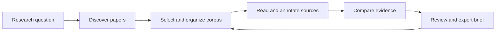

# Rebrand proposal: Evidara

Status: proposed, not adopted. Date: 2026-09-27. This phase defines the direction; the existing name, product UI, package identity, repository, and deployment remain current until implementation is approved.

## Strategic direction

**Working name: Evidara.** Descriptor: **Research Evidence Workspace.** Tagline: **Every conclusion, connected to evidence.**

The name suggests evidence and discovery while allowing the product to extend beyond abstracts into project libraries, document reading, comparisons, and research briefs. It is a creative working candidate: trademark, domain, repository handle, social handle, pronunciation, and competitor-confusion checks are outstanding. No availability or legal clearance is claimed. Alternatives for testing are **Tracefolio** (strong provenance/portfolio association) and **Studyloom** (study synthesis association); these are equally uncleared.

Abstractify's present brand emphasizes simplification and a consensus score. The proposed brand emphasizes a reproducible trail from question to source to conclusion. Its distinction should be visible in the workflow: users can inspect why a claim appears, which source supports it, what is missing, and which parts they have reviewed.

## Audience and product promise

Primary audience hypothesis: graduate students, literature-review authors, and research teams who need to collect, compare, and explain papers. Secondary audience: technically literate professionals assessing a research question. Validate with interviews before committing to discipline-specific workflows.

Core job: “Help me turn a research question and a set of papers into an evidence brief I can verify, revise, and reuse.”

Promise: discover relevant literature, inspect findings beside their sources, organize a durable project, and export a traceable brief. Avoid claims of scientific certainty, exhaustive coverage, guaranteed free operation, autonomous self-learning, or validated multi-agent intelligence until those capabilities exist and are evaluated.

Suggested landing copy:

> Research with the evidence in view.
>
> Find papers, compare findings, and build a brief with sources you can inspect.
>
> Start a research project.

Supporting proof must be factual: open-source license; supported discovery providers; explicit BYOK options; available export formats. Show capability status rather than unsupported comparison tables.

## New product format

Change from one long dashboard to a project-centered workspace.

| Area     | Purpose                                             | Core interaction                                                  |
| -------- | --------------------------------------------------- | ----------------------------------------------------------------- |
| Projects | Return to research questions, documents, and briefs | Create/open/archive a project; show persistence status            |
| Discover | Search and triage papers                            | Query, source/year filters, relevance explanation, add to library |
| Library  | Maintain the selected corpus                        | Sort, tag, deduplicate, attach PDFs, mark inclusion/exclusion     |
| Reader   | Understand a document with evidence visible         | PDF/text panel, page anchors, notes, source-linked questions      |
| Evidence | Compare findings and disagreements                  | Study matrix, sourced claim cards, abstract/full-text labels      |
| Brief    | Create and revise the final dossier                 | Editable outline, citations, uncertainty, review status, export   |
| Settings | Configure supported capabilities                    | Provider availability, key retention, budgets, data controls      |

Desktop composition: compact project navigation on the left, a primary working surface in the center, and a collapsible source/details panel on the right. Reader and comparison workflows use more horizontal space; graph exploration is a dedicated optional view. Mobile uses one primary surface and source details in a sheet, with navigation reachable without horizontal overflow.

The recommended journey is sequential but revisitable:



## Visual direction: contemporary research studio

Keep the useful scholarly feel, but remove the decorative journal issue/volume framing and heavy uppercase microcopy. Aim for quiet surfaces, readable tables, disciplined typography, and visible evidence states. This is written art direction, not a rendered or browser-tested design.

| Token role           | Proposed light value | Purpose                             |
| -------------------- | -------------------- | ----------------------------------- |
| Canvas               | `#F6F7F9`            | Cool neutral workspace              |
| Surface              | `#FFFFFF`            | Reader, table, and source panels    |
| Primary text         | `#182230`            | High-legibility body and headings   |
| Secondary text       | `#526071`            | Metadata and secondary explanations |
| Border               | `#D9E0E8`            | Subtle structural separation        |
| Action               | `#2756D8`            | Links, primary action, selection    |
| Supporting evidence  | `#126749`            | Positive stance with a text label   |
| Conflicting evidence | `#A52E3D`            | Conflict with a text label          |
| Uncertain/limited    | `#805B14`            | Missing or inconclusive evidence    |

Typography: one readable sans-serif family for interface/body, an optional restrained serif for the brand or long-form brief headings, and monospace only for identifiers. Begin with system fonts and verified open-license assets; final typeface selection is a design phase decision. Body text 15–16px, metadata 12–13px, comfortable line length, and 1.5 line height are design targets. Verify final combinations for contrast rather than assuming token values ensure compliance.

Use a 4px spacing base, 8–12px panel radii, modest borders, and subtle elevation only for temporary overlays. Avoid displaying scientific importance through glow, decorative graphs, or invented confidence badges. Support dark mode after semantic tokens and the main workflow are stable; every evidence state must retain text/icon identification in both themes.

Components to design: project switcher, research input, source filter, paper row/card, provenance badge, evidence excerpt, editable claim, review-state marker, comparison cell, PDF annotation, citation picker, progress stage, empty/error state, export dialog, and credential dialog.

Accessibility targets: semantic controls, visible keyboard focus, meaningful labels, minimum 44px touch targets where practical, usable 200% zoom, reduced motion, keyboard alternatives to graph interaction, and screen-reader announcements for async progress. Test at 360px, 768px, and 1440px widths. A visual audit is still required.

## Honest capability and state language

| Current wording/behavior                            | Proposed language                                                              |
| --------------------------------------------------- | ------------------------------------------------------------------------------ |
| “Consensus” or “Agreement” as scientific certainty  | “Stance across the selected papers” plus counts, basis, and unclassified total |
| Key-free fabricated comparison or equation response | “Analysis unavailable: configure a supported provider”                         |
| “TF-IDF extraction fallback” without calculation    | Remove the claim; display existing metadata only                               |
| Internal agent tool logs in the chat                | “Checked 3 document passages” with clickable sources                           |
| Model selector with unavailable providers           | Only show implemented providers; mark experiments unavailable                  |
| “Graphizing citation networks”                      | “Loading citation relationships”                                               |
| Silent truncated PDF                                | “Indexed X of Y pages/chunks” with the reason for incomplete coverage          |
| HTTP success when persistence fails                 | Visible “Saved locally” / “Saved to project” / “Save failed” status            |

Every analysis panel needs idle, queued, running, partial, completed, unavailable, cancelled, and failed states. A paper list should remain useful even when generation fails. New queries must cancel obsolete work or ignore stale responses.

## New output format: evidence dossier

Export a versioned project artifact rather than disconnected panels. Proposed formats: JSON as the canonical interchange, Markdown as a readable brief, CSV for extraction, and BibTeX/RIS for citations after format validation.

```json
{
    "schemaVersion": "1.0",
    "project": { "id": "project-id", "question": "Research question" },
    "generatedAt": "ISO-8601 timestamp",
    "search": { "providers": [], "filters": {}, "retrievedAt": "ISO-8601 timestamp" },
    "papers": [],
    "claims": [],
    "evidence": [],
    "limitations": [],
    "review": { "status": "draft", "reviewedBy": null }
}
```

Each paper carries stable internal ID, source IDs, DOI, metadata provenance, and abstract/full-text availability. Each claim references evidence IDs; each evidence record references paper/document ID, source excerpt, section/page when available, extraction method, and review state. Never fabricate page anchors from character chunks. Include provider/model/prompt version for reproducibility without secrets or raw internal reasoning. Remove private document text from shareable exports unless the owner intentionally includes it and has rights to do so.

## Functions and research skills

The first release should add owner-scoped projects, paper selection/library, provenance-linked extraction, cited document answers, coherent export, and reliable async states. Follow with open-access links, DOI deduplication, retraction/status lookup, screening criteria, reading notes, and carefully labelled gap suggestions.

Product “skills” are named, bounded research tasks, not a promise of independent autonomous agents. Their inputs, outputs, tool permissions, and evaluation gates are defined in [the catalog](../skills/RESEARCH-SKILLS.md). Multi-agent orchestration and persistent self-learning should wait until single-workflow quality is measured.

## Identity migration checklist

1. Validate the audience and test candidate names. Clear trademark/domain/handle risks separately; do not purchase or rename in this phase.
2. Centralize approved display name, descriptor, accent tokens, logos, and export prefix. Update accessibility labels and metadata.
3. Update HTML title/copy, app comments, package name and lockfile root metadata, README, screenshots, wiki, support/security/community files, issue templates, workflow messages, User-Agent values, notebook references, and export filenames.
4. Preserve repository history, attribution, MIT license, existing API routes, and export schema compatibility. Introduce redirects/version adapters if public URLs or payloads change.
5. Migrate browser preference keys through a versioned routine. Do not silently copy persistent API keys into a new storage model.
6. Verify every supported workflow and all brand occurrences. Capture new screenshots from the final build and remove stale feature claims.
7. Publish only after the owner approves the concrete build and the release gates pass. Production/repository/domain changes are separate actions.

Success hypotheses to measure after baseline instrumentation: faster first useful paper selection, higher claim-to-source coverage, more projects resumed successfully, fewer unsupported outputs, and lower p95 analysis time/cost. Do not invent numeric performance gains before measurement.
